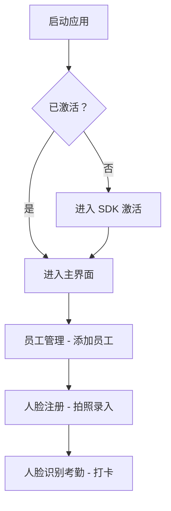
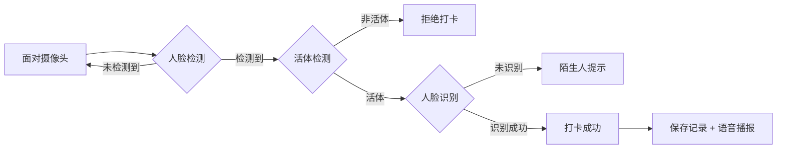

# 人脸识别考勤系统 - 应用说明文档

## 📱 应用概述

**应用名称**: 人脸识别考勤系统 (ArcFace Attendance Demo)
**包名**: `com.arcsoft.arcfacedemo`
**基于**: ArcSoft ArcFace SDK
**最低 Android 版本**: Android 4.4 (API 19)
**目标 Android 版本**: Android 10 (API 29)

---

## 🏗️ 系统架构

### 技术栈

| 组件 | 技术 |
|------|------|
| UI 框架 | Android View + DataBinding |
| 架构模式 | MVVM (ViewModel + LiveData) |
| 数据库 | Room Database |
| 网络请求 | Retrofit + OkHttp + RxJava |
| 人脸识别 | ArcSoft ArcFace SDK |
| 崩溃监控 | xCrash |

### 项目结构

```
app/src/main/java/com/arcsoft/arcfacedemo/
├── api/                          # API 接口层
│   ├── interceptor/              # HTTP 拦截器
│   ├── model/                    # API 数据模型
│   ├── repo/                     # API 仓库
│   └── service/                  # API 服务
├── attendance/                   # 考勤模块
│   ├── dao/                      # 数据访问对象
│   ├── model/                    # 数据实体
│   ├── repository/               # 数据仓库
│   ├── service/                  # 业务服务
│   └── ui/                       # UI 辅助类
├── demo/                         # 演示 Activity
│   ├── AttendanceDemoActivity    # 考勤门禁演示
│   └── AttendanceQueryActivity   # 考勤查询
├── dooraccess/                   # 门禁模块
├── employee/                     # 员工管理模块
├── facedb/                       # 人脸数据库
├── faceserver/                   # 人脸注册服务
├── integration/                  # 数据集成层
├── preference/                   # 设置偏好
├── ui/                           # UI 层
│   ├── activity/                 # Activity
│   ├── adapter/                  # 适配器
│   ├── model/                    # UI 模型
│   └── viewmodel/                # ViewModel
├── util/                         # 工具类
│   ├── camera/                   # 相机工具
│   ├── face/                     # 人脸处理
│   └── debug/                    # 调试工具
└── widget/                       # 自定义 View
```

---

## 📋 功能模块

### 1. 人脸识别考勤 (RegisterAndRecognizeActivity)

**功能描述**: 实时人脸识别，支持多种打卡方式

**核心功能**:
- ✅ 实时人脸检测与识别
- ✅ 人脸注册（拍照登记）
- ✅ 活体检测（RGB/IR 双摄像头）
- ✅ 多打卡方式切换

**打卡方式**:
| 方式 | 说明 | 操作 |
|------|------|------|
| 人脸识别 | 自动识别人脸并打卡 | 面对摄像头 |
| NFC 打卡 | 使用 NFC 卡/读卡器 | 刷 NFC 卡 |
| 二维码 | 扫描二维码打卡 | 扫描枪扫描 |

**管理员入口**:
- 📍 **位置**: 屏幕左下角（隐藏区域）
- 🔐 **操作**: 2 秒内连续点击 5 次
- 📝 **默认密码**: `123456`
- 🎯 **功能**: 验证后跳转到管理主界面

**布局说明**:
```
┌─────────────────────────────────┐
│     顶部状态栏 (系统在线)        │
│                                 │
│         摄像头预览区域           │
│                                 │
│    [识别结果列表 - 半透明]       │
│                                 │
│  ┌──────┐              ┌──────┐ │
│  │隐藏  │              │切换  │ │
│  │管理员│              │打卡  │ │
│  │区域  │              │方式  │ │
│  │(5 次)│              │按钮  │ │
│  └──────┘              └──────┘ │
│   左下角                   右下角 │
└─────────────────────────────────┘
```

---

### 2. 主界面 (HomeActivity)

**功能菜单**:

| 图标 | 功能 | 说明 |
|------|------|------|
| 👤 | 人脸识别考勤 | 进入考勤打卡界面 |
| 🔍 | 活体检测 | 测试活体识别功能 |
| 📷 | 人脸属性 | 单图人脸属性分析 |
| ⚖️ | 人脸比对 | 1:1 人脸比对 |
| 👥 | 员工管理 | 管理员工信息与人脸 |
| ⚙️ | 设置 | 系统参数配置 |
| 📊 | 考勤查询 | 查询考勤记录与报表 |
| 🔑 | SDK 激活 | 在线/离线激活 |

**诊断功能**:
- 点击底部"Diagnose"按钮
- 查看员工数据、人脸数据
- 检查数据关联关系

---

### 3. 员工管理 (EmployeeManageActivity)

**功能**:
- 添加/编辑/删除员工
- 批量导入员工
- 员工人脸注册
- 部门/岗位管理

**数据模型**:
```java
EmployeeEntity {
    employeeId       // 员工 ID
    employeeNo       // 工号
    name            // 姓名
    faceId          // 关联的人脸 ID
    departmentId    // 部门 ID
    positionId      // 岗位 ID
    phone           // 电话
    status          // 状态 (ACTIVE/INACTIVE)
    hireDate        // 入职日期
}
```

---

### 4. 考勤查询 (AttendanceQueryActivity)

**功能**:
- 📋 员工列表查询
- 📅 考勤记录查询
  - 全部记录
  - 今日记录
  - 本周记录
- 📊 考勤报表生成
  - 本月月报
  - 上月月报

**报表统计项**:
- 应出勤天数
- 实出勤天数
- 出勤率
- 正常/迟到/早退/缺勤/加班次数

---

### 5. 考勤门禁演示 (AttendanceDemoActivity)

**演示功能**:
- ➕ 添加员工
- ✅ 上班打卡
- ❌ 下班打卡
- 🚪 门禁验证
- 📝 查询记录
- 📊 生成报表
- 📋 员工列表

---

## 🗄️ 数据库设计

### 数据表

| 表名 | 说明 | 主要字段 |
|------|------|----------|
| `face` | 人脸特征表 | faceId, userName, faceFeature |
| `department` | 部门表 | departmentId, departmentName, description |
| `position` | 岗位表 | positionId, positionName, description |
| `employee` | 员工表 | employeeId, employeeNo, name, faceId, departmentId, positionId |
| `attendance_record` | 考勤记录表 | employeeId, date, checkInTime, checkOutTime, status |
| `attendance_rule` | 考勤规则表 | workMode, workDays, morningStart, afternoonStart |
| `holiday` | 节假日表 | date, holidayType, name |
| `door_access_record` | 门禁记录表 | employeeId, accessType, accessResult, accessTime |

### 数据库位置
```
/sdcard/Android/data/com.arcsoft.arcfacedemo/files/database/faceDB.db
```

---

## ⚙️ 系统设置

### 相机设置
- 相机切换（前置/后置）
- 双目相机偏移调整
- 预览镜像设置
- 分辨率选择

### 识别设置
- 识别角度（0°/90°/180°/270°/全角度）
- 识别阈值
- 同屏识别人数限制
- 识别区域限制
- 人脸尺寸限制
- 人脸移动限制

### 活体检测设置
- 活体检测类型
  - RGB 活体（单目）
  - IR 活体（双目）
  - 禁用活体
- 活体阈值
- 活体人脸质量阈值

### 图像质量检测
- 遮挡阈值
- 眼睛开启阈值
- 嘴巴闭合阈值
- 戴眼镜阈值

---

## 🔐 权限说明

| 权限 | 用途 |
|------|------|
| `CAMERA` | 人脸识别拍照 |
| `READ_PHONE_STATE` | 设备激活验证 |
| `READ/WRITE_EXTERNAL_STORAGE` | 存储激活文件、人脸照片 |
| `INTERNET` | 网络激活、API 请求 |
| `NFC` | NFC 打卡（可选） |
| `VIBRATE` | 打卡成功震动反馈 |

---

## 🔧 配置说明

### SDK 激活

**在线激活**:
1. 进入"SDK 激活"界面
2. 输入 `appId`、`sdkKey`、`activeKey`
3. 点击"在线激活"

**离线激活**:
1. 点击"复制设备信息"
2. 在开放平台生成离线 license 文件
3. 将文件命名为 `active_result.dat` 放在 sdcard 根目录
4. 点击"离线激活"

### 配置文件位置

| 配置 | 路径 |
|------|------|
| 激活配置 | `/sdcard/activeConfig.txt` |
| 离线许可 | `/sdcard/active_result.dat` |
| 人脸数据库 | `/sdcard/Android/data/com.arcsoft.arcfacedemo/files/database/faceDB.db` |
| 人脸照片 | `/sdcard/Android/data/com.arcsoft.arcfacedemo/files/faces/` |

---

## 🎯 使用流程

### 初次使用



### 员工录入流程

1. 进入**员工管理**界面
2. 点击"+"添加员工
3. 填写工号、姓名、部门、岗位
4. 点击"拍照"采集人脸
5. 系统自动注册人脸特征
6. 注册成功后员工列表显示

### 打卡流程



---

## 🛠️ 常见问题

### 1. SDK 激活失败
- 检查网络连接
- 验证 appId、sdkKey、activeKey 是否正确
- 检查设备信息是否匹配

### 2. 无法检测到人脸
- 检查相机权限是否授予
- 调整识别角度设置
- 确保光线充足
- 检查相机是否被其他应用占用

### 3. 活体检测失败
- 确认活体检测类型设置正确
- 调整活体阈值
- 检查是否为 IR 相机（双目模式）

### 4. 打卡无响应
- 检查是否已注册人脸
- 确认识别阈值设置
- 查看日志确认识别状态

### 5. NFC 打卡不工作
- 检查 NFC 权限
- 确认 NFC 功能已启用
- USB 读卡器模式无需 NFC 权限

---

## 📝 打卡方式配置

### 人脸识别打卡（默认）
- 无需额外配置
- 相机自动检测并识别

### NFC 打卡
**方式一：USB NFC 读卡器**（推荐）
- 读卡器模拟键盘输出
- 无需 NFC 权限
- 将 NFC 卡靠近读卡器即可

**方式二：原生 NFC**
- 需要 NFC 权限
- 需要设备支持 NFC
- 在设置中启用 NFC

### 二维码打卡
- 需要扫码枪
- 扫码枪模拟键盘输入
- 扫描后自动打卡

---

## 🎨 UI 主题

### 科技主题 (TechTheme)
- 渐变背景
- 科技感扫描线动画
- 四角装饰框
- 霓虹色彩方案

### 全屏主题 (FullScreenTheme)
- 隐藏状态栏
- 隐藏导航栏
- 沉浸式体验

---

## 📊 考勤规则

### 默认规则
| 项目 | 设置 |
|------|------|
| 工作模式 | 固定工时 |
| 工作天数 | 31 天 |
| 上午上班 | 08:30 |
| 上午下班 | 12:00 |
| 下午上班 | 13:30 |
| 下午下班 | 18:00 |
| 迟到容忍 | 5 分钟 |
| 早退容忍 | 5 分钟 |
| 加班阈值 | 60 分钟 |

### 状态说明
- **正常**: 按时上下班
- **迟到**: 上班时间后打卡
- **早退**: 下班时间前离开
- **缺勤**: 未打卡
- **加班**: 超过加班阈值

---

## 🔗 API 接口

### 考勤 API (可选)
如需对接云端考勤系统，可配置 API 服务：

```java
// API 配置
ApiConfig.BASE_URL = "https://your-server.com/api"

// 打卡请求
PunchRequest {
    employeeNo: String
    punchType: "CHECK_IN" | "CHECK_OUT"
    timestamp: Long
    imagePath: String
}

// 打卡响应
PunchResponse {
    code: Int
    message: String
    data: PunchResult
}
```

---

## 📱 适配说明

### 相机适配
- 支持单目/双目摄像头
- 支持前后摄像头切换
- 支持相机分辨率调整
- 支持预览旋转和镜像

### 屏幕适配
- 支持横屏/竖屏
- 支持全面屏
- 支持平板设备

---

## 🧪 调试功能

### 识别调试界面
- 实时查看人脸检测框
- 查看活体检测分数
- 查看识别相似度
- 导出调试数据

### 数据诊断
- 查看员工数据
- 查看人脸数据
- 检查关联关系
- 修复数据异常

---

## 📄 开源库依赖

| 库 | 版本 | 用途 |
|----|------|------|
| AndroidX AppCompat | 1.1.0 | 基础组件 |
| AndroidX Lifecycle | 2.2.0 | 生命周期 |
| AndroidX Room | 2.2.5 | 数据库 |
| AndroidX RecyclerView | 1.1.0 | 列表 |
| Material Design | 1.1.0 | UI 组件 |
| Glide | 4.9.0 | 图片加载 |
| Retrofit | 2.9.0 | 网络请求 |
| RxJava2 | 2.2.9 | 响应式编程 |
| xCrash | 3.0.0 | 崩溃监控 |

---

## 📞 技术支持

**ArcSoft 官网**: https://www.arcsoft.com/
**视觉开放平台**: https://ai.arcsoft.com/

---

## 📝 更新日志

### v1.0
- 初始版本发布
- 支持人脸识别考勤
- 支持员工管理
- 支持考勤记录查询
- 支持 NFC/二维码打卡
- 支持隐藏管理员入口

---

## ⚠️ 注意事项

1. **隐私保护**: 请确保获得终端用户授权收集人脸信息
2. **数据安全**: 建议加密存储人脸特征数据
3. **合规使用**: 遵守当地法律法规和隐私政策
4. **性能优化**: 大量人脸时建议定期清理数据库

---

*文档生成日期：2026-03-03*
